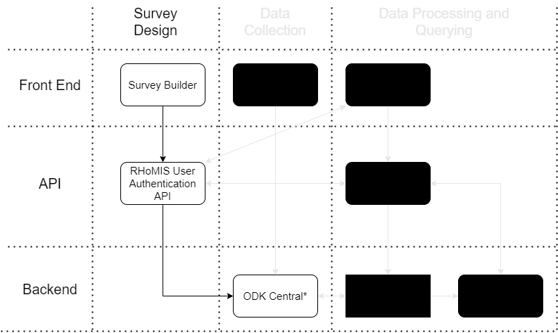
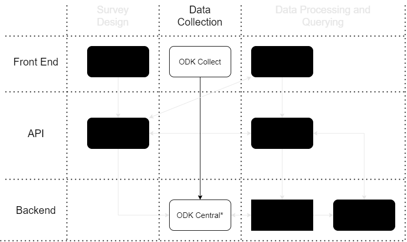
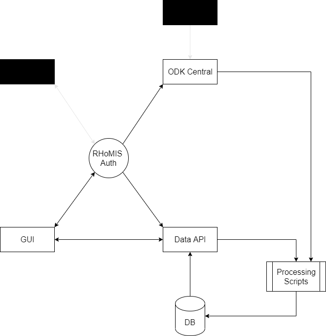

.. _developer_guide:

Developer Guide
===========================================

This developer guide is to help people working on RHoMIS 2.0, and potential new contributors, understand how RHoMIS 2.0 
components generally work and how they interact with one another. It does not cover installation, testing, 
and contributions, nor does it cover the specifics of the source code. For a more in depth look at how to install, 
test, and contribute, we recommend looking at the GitHub repositories for each of the individual components. 

For a quick overview, To access the individual repositories and other essential information, please go to :ref:`important_links`

Summary of the RHoMIS 2.0 System
-------------------------------------------
.. figure:: images/system_summary.png

    A summary of the RHoMIS 2.0 system components
    and how they interact.

RHoMIS 2.0 us made up of a series of interoperable applications. 
Users can interact with these components in a range of ways. 
However, generally we expect users to interact with components in the following order:

#. Survey builder
#. ODK system
#. Data querying dashboard (GUI)

Broadly, there are a few key tasks we expect users of RHoMIS 2.0 to carry out:

* Survey creation
* Project, form, and user management (administration)
* Data collection
* Data processing
* Data querying and download

At the centre of the system we have the RHoMIS authentication API. 
This is used to manage users, projects, and forms. It ensures that all
other components are up to date. 

To simplify the system, we have broken the system down to show how it
works for key processes.

Survey creation
********************************

    A summary of how components interact for the "survey creation" process.
    Irrelevant components and interactions have been blacke/greyed out.
    Please note that the survey builder has its own backend, where survey module information is stored. 
    For more information, please see :ref:`survey_builder_dev`.

The survey builder is the first place a user should land when they decide to use RHoMIS 2.0. 
When accessing the survey builder, the user will be prompted to create an account or login. The survey builder
will send a request to the user authentication system.
See the :ref:`user_authentication_summary` for more details about user login and registration. 
Once a user is logged in, they will be able to create projects and forms using the survey builder. 
This sends requests through the Auth API and creates the forms in ODK Central. Simultaneously, this 
information is sent to the RHoMIS database.

Data collection
******************************

    Data collection schematic.

For data collection and the management of raw data RHoMIS 2.0 currently relies on 
`ODK collect <https://docs.getodk.org/collect-intro/>`_ and `ODK central <https://docs.getodk.org/central-intro/>`_. 
After users have created an account, a project, and a form on the RHoMIS system, these will be available on ODK
central. Data collectors will then need to download the ODK collect application to collect data.
To configure the ODK collect app, users will need a QR code. Currently they have to go on to ODK central
to access this QR code, however, there are ways to generate this QR code both on the rhomis data app and the survey builder.

Once ODK collect is configured, users can begin collecting data.

Data processing
*******************************

    Schematic of processing steps

RHoMIS 2.0 relies on the R programming language for it's automated processing, calculations, and reporting. 
An `R-package <https://github.com/l-gorman/rhomis-R-package>`_ has been developed for RHoMIS 2.0 data processing. 
This package, is designed for use on the data-processing server, 
as well as for use by the wider community who hope to analyse rhomis data themselves.

On the RHoMIS server, there are a series of data-processing scripts which use functions from the
RHoMIS package to manage metadata, generate mock responses, and process data. The user authenticates 
using the authentication system. The authentication server checks which projects the user has access to. 
From the RHoMIS data application, the user can request to generate/process data for the projects they have
access to. They make a request to the API, which calls the R scripts. The R scripts request raw data from ODK central, 
and project information from the authentication server. The scripts process the data and write the output
to the RHoMIS database.

Querying and Download
******************************

The query and download interface calls the authentication API to obtain a user token.
This user token is then sent to the RHoMIS data API and decoded to identify the relevant user.
The user is then able to access their own project data and project-metadata through the API.

.. image:: images/querying_data.png

.. _user_authentication_summary:

User Authentication System
*******************************

To create an account or login, an application makes a request to the user authentication server. 
When logging in, the authentication server returns a token which can be decoded to give a user ID. 
This user ID is used by each RHoMIS application to manage survey projects.