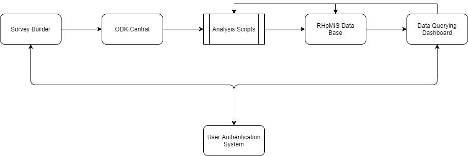

.. _developer_guide:

Developer Guide
===========================================

Summary of the RHoMIS 2.0 System
-------------------------------------------

RHoMIS 2.0 us made up of a series of interoperable applications. See below for a simple summary of these components
and how they interact:

Each component of the RHoMIS system is summarised below. Users can interact with these components in a range of ways. However, generally we expect users to interact with components in the following order:

#. Survey builder
#. ODK system
#. Data querying dashboard

Generally, this should be the first point the user lands. When accessing the survey builder, the user will be prompted to create an account or login. To create an account or login, the survey builder makes a call to the user authentication server. When logging in, the authentication server returns a token which can be decoded to give a user ID. This user ID is shared between the survey builder, the RHoMIS database, and the authentication system to manage survey projects.

Survey Builder
******************************

