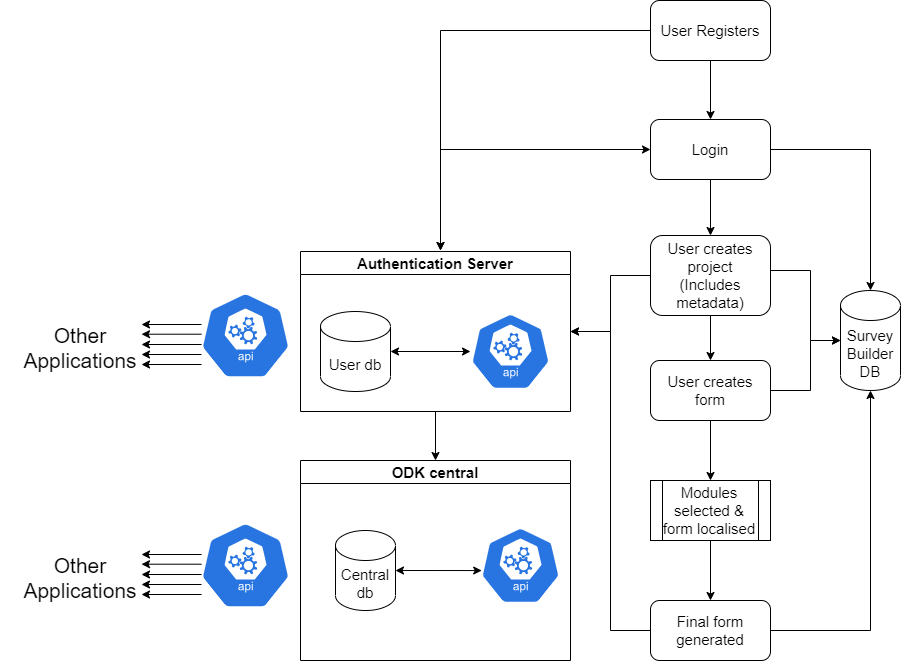
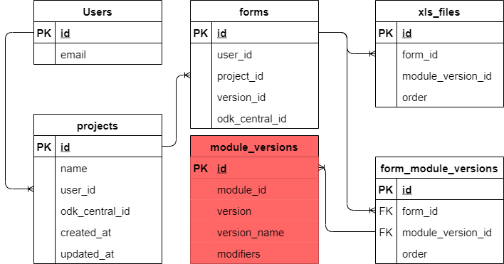
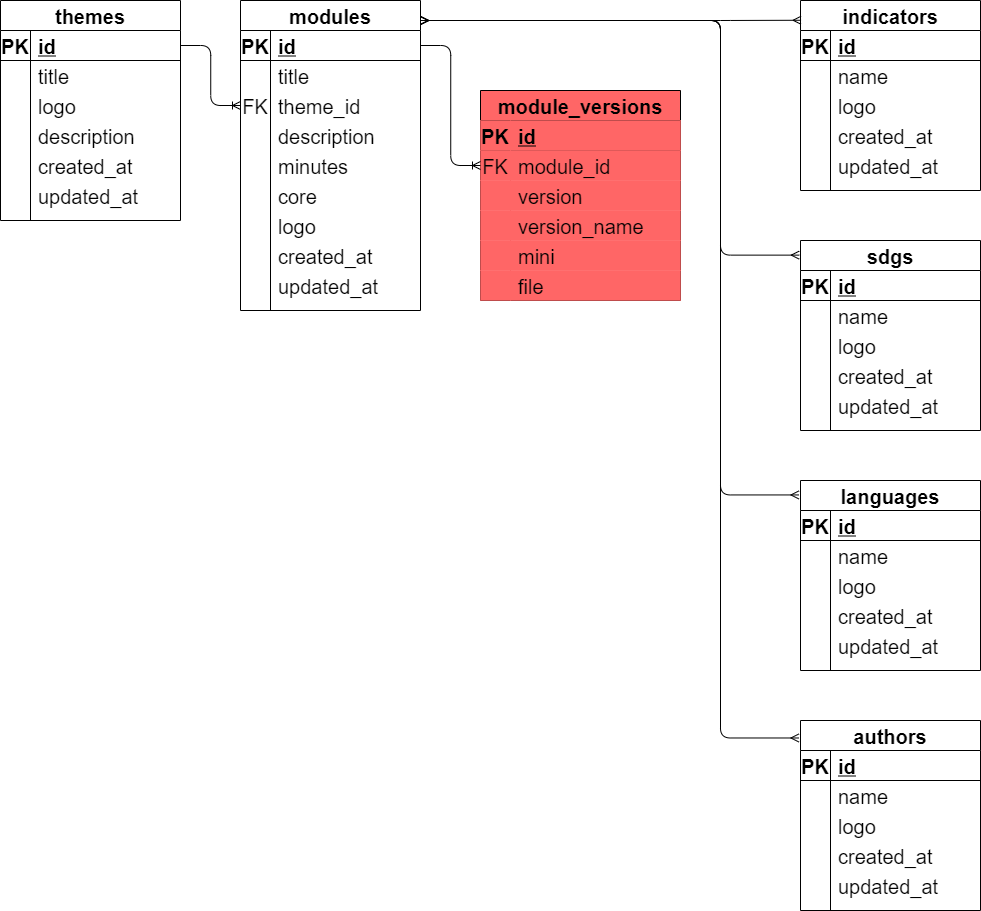

.. _survey_builder_dev:

Contributor Guide
==================================

Essential information
-----------------------------------

The code for the RHoMIS 2.0 survey builder can be found `here <https://github.com/stats4sd/survey-builder>`_.
The application is written using laravel.

The survey builder requests infromation from:

* The authentication server

The survey builder gives information to the following components of RHoMIS 2.0:

* RHoMIS ODK central server
* RHoMIS database
* Analysis Scripts

Processes
------------------------------------

We begin by the user registering to use RHoMIS through the authentication server. The user sends a request with their email and password. They are then assigned an ID and their password is hashed and stored. When logging in, the user gives their email and password. This is verified, and a token is returned to the authenticated user. This token is decoded by the survey builder, and the user ID is stored locally in the survey builder database. 

A user can then create projects. Within these projects the user creates forms. For form creation, modules are selected from the database and the form is localised. Note how the survey builder works throughout the process. It saves information in its own database and also synchronises with other applications in RHoMIS 2.0. When a user registers, their credentials are saved in a centralised RHoMIS 2.0 authentication server. The user id is then saved in the survey builder
database, along with the email. Projects, forms, and metadata are stored in the survey builder db as well as 
in ODK central.

Database 
------------------------------------

Projects Users and Forms
************************************

Survey Module 
************************************

