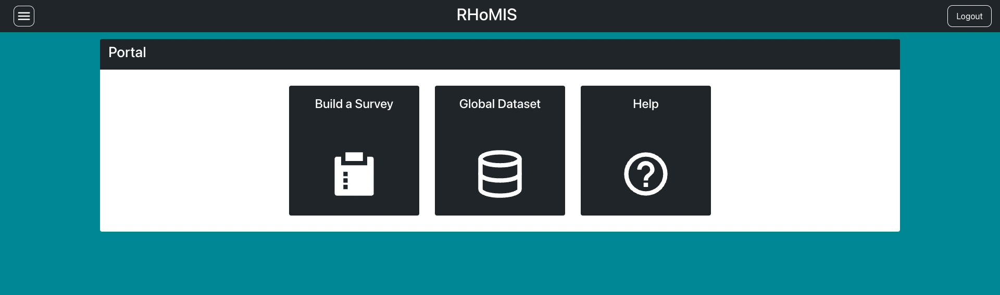

.. _quickstart_guide:

Quickstart
=============================

Creating an Account
#############################

If you using RHoMIS for the first time, you will need
to create an account. Visit the `RHoMIS App`_. When 
opening the app, you will be directed to the login page.

Click the option to register, as shown in the video below.
Fill in the form and then submit, you will be redirected
back to the login page. Use the username and password 
you have just entered, and login

.. youtube:: M0lMZK9KHy8
    :width: 100%

RHoMIS Portal
#############################

Once you have logged in for the first time 
the main RHoMIS application will look like this:

You can click on any of the panels in the centre. 

1. Build a Survey: Go to the RHoMIS survey builder and begin designing a survey (more guidance :ref:`here <survey builder>`)
2. Global Dataset: Visit out page on the `Harvard Dataverse`_
3. Help: Visit this documentation for more guidance.

